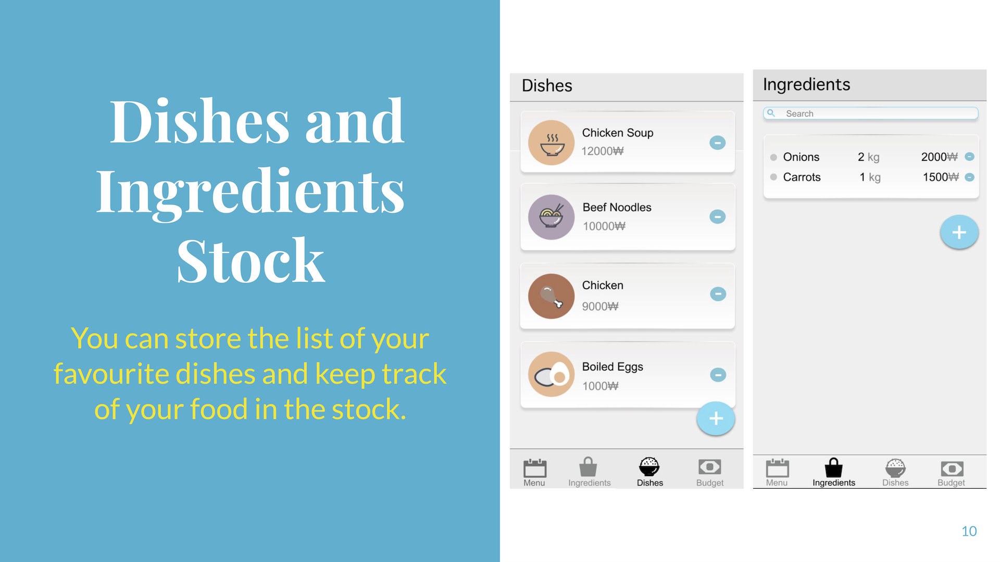
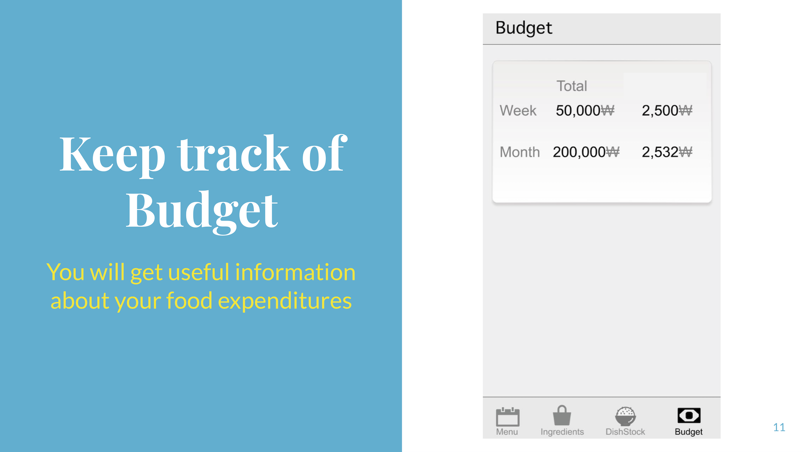

## CookiT

A simple Android cooking scheduler/timetable application

## Description

CookiT is a course project for CS350: Introduction to Software Engineering @ KAIST, School of Computing.

It's an application for scheduling(i.e. timetable) cooking designed to help university students to manage their needs during cooking.

## Demo

## Contributors
- [Ayan Mukanov](https://github.com/mukanov8)
- [Bekzat Tlekbay](https://github.com/fesiib)
- [Yuan Huang](https://github.com/huangyuan9811)
